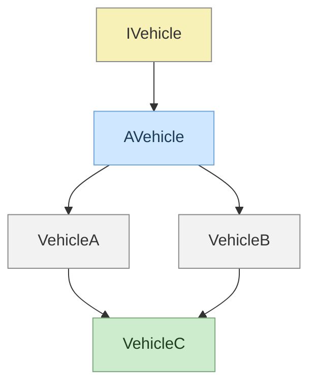

# Concepts avancés de la programmation orientée objet (POO)

**La programmation orientée objet** est une façon de programmer qui consiste à organiser le code autour d’objets plutôt que de simples fonctions. Un objet, c’est une sorte de *“chose”* qui représente un élément du monde réel comme une *voiture, un étudiant ou un compte bancaire.*

## 1.1. Les classes et objets

> **Un objet** est une structure de données qui regroupe des **valeurs nommées appelées propriétés** et des **fonctions appelées méthodes.**

> **Une classe** est un modèle ou un plan qui décrit **les caractéristiques (propriétés) et les comportements (méthodes)** que posséderont les objets créés à partir d’elle.

Pour créer une classe, on définit d’abord sa déclaration dans un fichier d’en-tête `.hpp`. Cette déclaration décrit la structure de la classe : ses propriétés, ses méthodes et ses constructeurs. Le fichier `.hpp` ne contient que cette description, sans implémentation :

```cpp title="Vehicle.hpp"
#ifndef VEHICLE_HPP
#define VEHICLE_HPP

// Une énumération définit un type contenant un ensemble fixe de valeurs possibles.
enum class Color {
    Black,
    White,
    Gray,
    Silver,
    Red,
    DarkRed,
    Crimson,
    Pink,
    HotPink,
    Blue,
    DarkBlue,
    Navy,
    SkyBlue,
    Cyan,
    Turquoise,
    Green,
    DarkGreen,
    Lime,
    Olive,
    Teal,
    Yellow,
    Gold,
    Orange,
    DarkOrange,
    Purple,
    Indigo,
    Violet,
    Magenta,
    Brown,
    SaddleBrown,
    Chocolate,
    Beige,
    Ivory,
    Coral
};

class Vehicle {
public:
    /** 
     * Le constructeur `Vehicle` est une fonction spéciale appelée lors de la
     * création d’un objet `Vehicle`. Il sert à initialiser l’objet avec la
     * couleur passée en paramètre.
     *
     * NOTE : Si une classe ne possède aucune propriété à initialiser,
     * on peut utiliser un constructeur par défaut :
     * `Vehicle() = default;`
     */
    Vehicle(Color color);

    /** 
     * Le destructeur est appelé quand l’objet disparaît, pour libérer les ressources
     * qu’il utilisait. Ici, il est défini par défaut car la classe ne gère aucune
     * ressource dynamique (mémoire allouée manuellement, fichiers, connexions, etc.).
     */
    ~Vehicle() = default;

    // Un setter permet de modifier une valeur
    void setColor(Color color);

    // Un getter permet de lire une valeur
    Color getColor() const;
private:
    // La propriété `_color` stocke la couleur associée au véhicule
    Color _color;
};

#endif
```

:::info
_Les mot-clés `public` et `private` sont des modificateurs d’accès utilisés pour les propriétés, les constructeurs et les méthodes. Il existe différents types de modificateurs d’accès, qui seront présentés progressivement._

> Les membres déclarés `public` sont accessibles depuis n’importe quel autre fichier, à condition que la déclaration de la classe soit visible via un `#include`.
> 
> Les membres déclarés `private` sont accessibles uniquement à l’intérieur de la classe dans laquelle ils sont définis.
:::

Le comportement réel des méthodes (et l’initialisation des propriétés) est ensuite implémenté dans un fichier source `.cpp` :

```cpp title="Vehicle.cpp"
#include "Vehicle.hpp"

Vehicle::Vehicle(const Color color) : _color(color) {}

void Vehicle::setColor(const Color color) {
    this->_color = color;
}

Color Vehicle::getColor() const {
    return this->_color;
}
```

Une fois la classe définie, il est possible de créer une instance de la classe `Vehicle` :

```cpp title="main.cpp"
#include <iostream>
#include "Vehicle.hpp"

int main() {
    // Créer un nouvel objet `vehicle`, c'est-à-dire une instance de `Vehicle`.
    Vehicle const vehicle(Color::Red);

    if (vehicle.getColor() == Color::Red)
        std::cout << "La couleur de la voiture est rouge !" << std::endl;
}
```

`ferrari` est une variable qui représente directement un objet, autrement dit une **instance** de la classe `Vehicle`. Lorsque l’on parle d’instance, on fait référence à l’objet complet en mémoire, c’est-à-dire à une structure qui regroupe des propriétés et des méthodes :

> **Une instance** désigne le fait que cet objet a été créé à partir d'un modèle (une classe).

## 1.2. Le polymorphisme : héritage et overriding

> **Le polymorphisme** est le concept global qui dit qu’un même objet peut avoir plusieurs comportements différents selon le contexte, grâce aux fonctions virtuelles et à l’overriding.

Si cela paraît flou, c’est normal : le concept sera abordé progressivement, étape par étape, à l’aide d’un exemple concret, puis d’explications détaillées :

```cpp title="Vehicle.hpp"
#ifndef VEHICLE_HPP
#define VEHICLE_HPP

enum class Color {...};

class Vehicle {
public:
    Vehicle(Color color);
    // Évite les problèmes de ressources non libérées, les fuites mémoire et les comportements indéfinis
    virtual ~Vehicle() = default;

    void setColor(Color color);
    Color getColor() const;

    // `virtual` permet de choisir la méthode à appeler au moment de l’exécution
    virtual void displayFuelType() const = 0;
protected:
    Color _color;
};

#endif
```

:::info
`protected` : Les membres déclarés `protected` sont accessibles à l’intérieur de la classe où ils sont définis ainsi que dans ses sous-classes. En revanche, ils ne sont pas accessibles depuis l’extérieur de cette hiérarchie de classes.
:::

```cpp title="Vehicle.cpp"
#include "Vehicle.hpp"

Vehicle::Vehicle(const Color color) : _color(color) {}

void Vehicle::setColor(const Color color) {
    this->_color = color;
}

Color Vehicle::getColor() const {
    return this->_color;
}
```

```cpp title="VehicleA.hpp"
#ifndef VEHICLE_A_HPP
#define VEHICLE_A_HPP

#include "Vehicle.hpp"

// Déclaration de la classe `VehicleA` héritant publiquement de `Vehicle`
class VehicleA : public Vehicle {
public:
    VehicleA(Color color);
    ~VehicleA() override = default;

    void displayFuelType() const override;
};

#endif
```

```cpp title="VehicleA.cpp"
#include "VehicleA.hpp"
#include <iostream>

VehicleA::VehicleA(const Color color) : Vehicle(color) {}

void VehicleA::displayFuelType() const {
    std::cout << "Le carburant utilisé est du SP98, optimisé pour les moteurs haute performance." << std::endl;
}
```

```cpp title="VehicleB.hpp"
#ifndef VEHICLE_B_HPP
#define VEHICLE_B_HPP

#include "Vehicle.hpp"

// Déclaration de la classe `VehicleB` héritant publiquement de `Vehicle`
class VehicleB : public Vehicle {
public:
    VehicleB(Color color);
    ~VehicleB() override = default;

    void displayFuelType() const override;
};

#endif
```

```cpp title="VehicleB.cpp"
#include "VehicleB.hpp"
#include <iostream>

VehicleB::VehicleB(const Color color) : Vehicle(color) {}

void VehicleB::displayFuelType() const {
    std::cout << "Le carburant utilisé est du SP98, optimisé pour les moteurs haute performance." << std::endl;
}
```

```cpp title="main.cpp"
#include "VehicleA.hpp"
#include "VehicleB.hpp"

int main() {
    // Créer un nouvel objet `vA`, c'est-à-dire une instance de `VehicleA` qui hérite de `Vehicle`.
    const VehicleA vA(Color::Red);
    vA.displayFuelType();

    // Créer un nouvel objet `vB`, c'est-à-dire une instance de `VehicleB` qui hérite de `Vehicle`.
    const VehicleB vB(Color::White);
    vB.displayFuelType();
}
```

### 1.2.1. L'héritage

Dans un premier temps, il convient de définir l’héritage et de comprendre son fonctionnement.

> **L’héritage** permet à une sous-classe de réutiliser les propriétés et les méthodes d’une super-classe.

```cpp
class VehicleA : public Vehicle {...};

class VehicleB : public Vehicle {...};
```

Le mot-clé `public Vehicle` signifie _"hérite de"_. Ainsi, les classes `VehicleA` et `VehicleB` héritent des propriétés et des méthodes de la super-classe `Vehicle`. Elles deviennent donc des sous-classes de `Vehicle`.

:::warning
Point très important à comprendre concernant l’héritage : il arrive que certaines méthodes soient redéfinies (overriding) dans une sous-classe. Toutefois, une sous-classe peut également choisir de ne pas redéfinir une méthode et d’utiliser directement celle héritée de la classe parente.

Afin de bien comprendre ces mécanismes, il est nécessaire de distinguer la surcharge (overloading) de la redéfinition (overriding).
:::

### 1.2.2. L'overriding : la redéfinition

> **L’overriding** est un mécanisme qui permet à une sous-classe de fournir sa propre implémentation d’une méthode déjà définie dans la classe parente. La méthode redéfinie doit avoir **le même nom, les mêmes paramètres et le même type de retour** que celle du parent.

La classe `Vehicle` définit :

```cpp title="Vehicle.hpp"
virtual void displayFuelType() const = 0;
```

Dans les sous-classes `VehicleA` et `VehicleB`, la même méthode est redéfinie :

```cpp title="VehicleA.hpp, VehicleB.hpp"
void displayFuelType() const override;
```

```cpp title="VehicleA.cpp, VehicleB.cpp"
void Ferrari::displayFuelType() const {
    std::cout << "Le carburant utilisé est du SP98, optimisé pour les moteurs haute performance." << std::endl;
}

void Tesla::displayFuelType() const {
    std::cout << "Ce véhicule est alimenté exclusivement par l’électricité." << std::endl;
}
```


#### 1.2.2.1. Le mot clé `virtual`

Pour comprendre le mot-clé `virtual`, il faut d’abord comprendre une problématique liée à l’héritage en programmation orientée objet. Lorsque deux objets différents partagent une même classe parente et appellent la même méthode, le compilateur ne sait pas toujours quelle version de la méthode utiliser.

```cpp
const Vehicle *vA = new VehicleA(Color::Red);
vA->displayFuelType();

const Vehicle *vB = new VehicleB(Color::White);
vB->displayFuelType();
```

Dans ce cas, les objets sont vus comme des `Vehicle`, même s’ils sont en réalité une `VehicleA` et une `VehicleB`. Sans mécanisme particulier, c’est la méthode de la classe `Vehicle` qui serait appelée. C’est ici qu’intervient le mot-clé `virtual`, qui permet **la liaison dynamique.**

> **La liaison dynamique** est un mécanisme qui détermine quelle méthode redéfinie (overriding) doit être exécutée au moment de l’exécution, selon le type réel de l’objet.

## 1.3. Interfaces et classes abstraites

> **Une interface** définit un contrat de comportement qu’une classe doit respecter, sans fournir d’implémentation ni contenir d’état.

> **Une classe abstraite** est une classe qu’on ne peut pas instancier, parce qu’elle contient au moins une méthode virtuelle pure (classe abstraite = classe de base incomplète).

:::warning
Ne pas confondre **méthode virtuelle** et **méthode virtuelle pure** : ce n’est pas la même chose. Une méthode virtuelle peut avoir une implémentation dans une classe, tandis qu’une méthode virtuelle pure (déclarée avec = 0) est uniquement déclarée et doit être implémentée dans les sous-classes.

> Méthode virtuelle pure : `virtual void func() = 0;`
> 
> Méthode virtuelle : `virtual void func();`

Il faut noter qu’une classe abstraite peut contenir des méthodes virtuelles, alors qu’une interface ne doit pas en contenir.
:::

```cpp title="IVehicle.hpp"
#ifndef IVEHICLE_HPP
#define IVEHICLE_HPP

enum class Color {...};

class IVehicle {
public:
    virtual ~IVehicle() = default;
    virtual void setColor(Color color) = 0;
    virtual Color getColor() const = 0;
    virtual void displayFuelType() const = 0;
};

#endif
```

Pour créer une interface, on déclare uniquement des méthodes virtuelles pures (à implémenter plus tard dans des sous-classes), ainsi qu’un destructeur virtuel défini par défaut, indispensable pour permettre une destruction correcte via un pointeur de base.

```cpp title="AVehicle.hpp"
#ifndef AVEHICLE_HPP
#define AVEHICLE_HPP

#include "IVehicle.hpp"

class AVehicle : public IVehicle {
public:
    AVehicle(Color color);
    ~AVehicle() override = default;

    void setColor(Color color) override;
    Color getColor() const override;
protected:
    Color _color;
};

#endif
```

Dans l’exemple ci-dessus, on présente la définition d’une classe abstraite qui hérite d’une interface (elle-même une classe abstraite). La classe `AVehicle` fournit une implémentation partielle, notamment pour la gestion de la couleur, mais laisse certaines méthodes non définies.

La méthode `displayFuelType()` devra être implémentée dans les classes concrètes qui hériteront de `AVehicle`.

## 1.4. Héritage multiple et ambiguïtés

> **L’héritage multiple** est un mécanisme qui permet à une classe d’hériter de plusieurs classes parentes simultanément. La classe dérivée combine ainsi les propriétés et les méthodes de chacune de ses classes de base.

Pour comprendre l’héritage multiple, on va reprendre le code utilisé précédemment pour présenter le polymorphisme, puis ajouter une troisième sous-classe qui héritera à la fois de `VehicleA` et de `VehicleB`. On l’appellera `VehicleC`.

L’héritage multiple peut conduire à une structure appelée **héritage en diamant** lorsque plusieurs classes parentes partagent une même classe de base :



---

Il suffit de faire hériter `VehicleA` et `VehicleB` dans la déclaration de la classe :

```cpp title="VehicleC.hpp"
#ifndef VEHICLE_C_HPP
#define VEHICLE_C_HPP

#include "VehicleA.hpp"
#include "VehicleB.hpp"

class VehicleC : public VehicleA, public VehicleB {
public:
    VehicleC(Color color);
    ~VehicleC() override = default;

    void displayFuelType() const override;
};

#endif
```

Puis, dans le constructeur, on appelle les constructeurs de chacune des classes parentes :

```cpp title="VehicleC.cpp"
#include "VehicleC.hpp"
#include <iostream>

VehicleC::VehicleC(const Color color)
    : AVehicle(color), VehicleA(color), VehicleB(color) {}

void VehicleC::displayFuelType() const {
    std::cout << "Ce véhicule expérimental fonctionne en mode hybride." << std::endl;
}
```

:::warning
Le problème ici est que `VehicleC` contient deux copies distinctes de `AVehicle`.

```cpp
VehicleC vC(Color::Red);
vC.setColor(Color::Black); // Ambiguïté sur les membres
```

Ici, le compilateur ne sait pas si l’on souhaite appeler `VehicleA::AVehicle::setColor` ou `VehicleB::AVehicle::setColor`. 
:::

:::success
Il faut donc partager une seule instance de `AVehicle` entre les deux classes en utilisant l’héritage virtuel :

```cpp
class VehicleA : virtual public AVehicle {...}
class VehicleB : virtual public AVehicle {...}
```

Dans le cas d’un héritage virtuel, c’est la classe la plus dérivée `VehicleC` qui est responsable de la construction de la base virtuelle `AVehicle`.
:::
